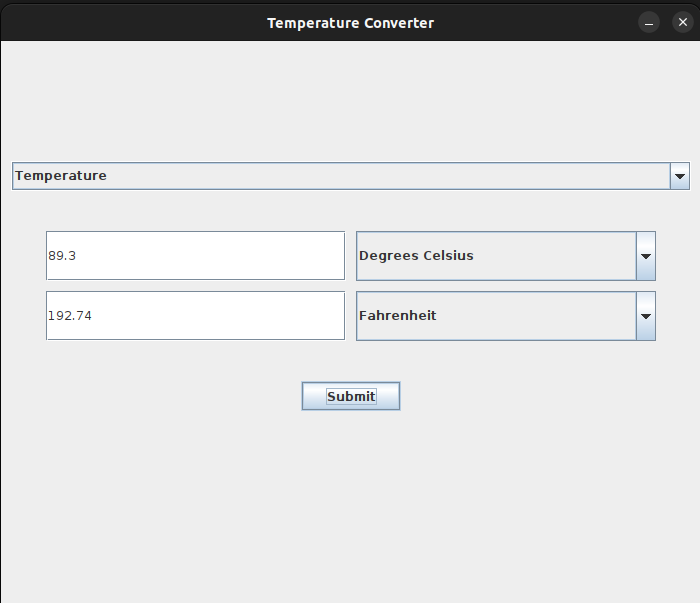

# Temperature Converter Using Java

This is a solution to the [Temperature Converter Project](https://github.com/Raymacmillan/Temperature-Converter).

## Table of contents

- [Overview](#overview)
  - [The challenge](#the-challenge)
  - [Screenshot](#screenshot)
  - [Links](#links)
- [My process](#my-process)
  - [Built with](#built-with)
  - [What I learned](#what-i-learned)
  - [Continued development](#continued-development)
- [Author](#author)
- [Acknowledgments](#acknowledgments)

## Overview

### The challenge

Users should be able to:

- Select between 3 different temperatures, Kelvin, Degrees Fahrenheit and Degrees Celsius
- Input a value within a particular temperature and see the results converted to the temperature of their choice
- Click on the submit button and get the result of the temperatures converted

### Screenshot

### Links

- Solution URL: [https://github.com/Raymacmillan/Temperature-Converter](https://github.com/Raymacmillan/Temperature-Converter)

## My process

### Built with

- Java 
- Java Swing

### What I learned

I learned how to program a simple program in Java for the first time. I learned how to work with Java Swing to create graphical user interfaces as well as
implementing methods. I also learn't how to get values of comboBoxes and textField and manipulate them to process data. Finally i learned how to convert
the different data types in java and work with single data types which was really amazing.

### Continued development

I would like to continue learning Java to the fullest by creating more application and learn different algorithms. But most importantly i want to learn to work with web servers for my next project in Java.

## Author
- Twitter - [@RyoGenxx](https://www.twitter.com/RyoGenxx)

## Acknowledgments

I would like to thank ChatGPT, StackOverflow, GeeksforGeeks and Google for assisting me with this amazing and interesting project and for clarifying all the
doubts i had as well as making concepts clearer.